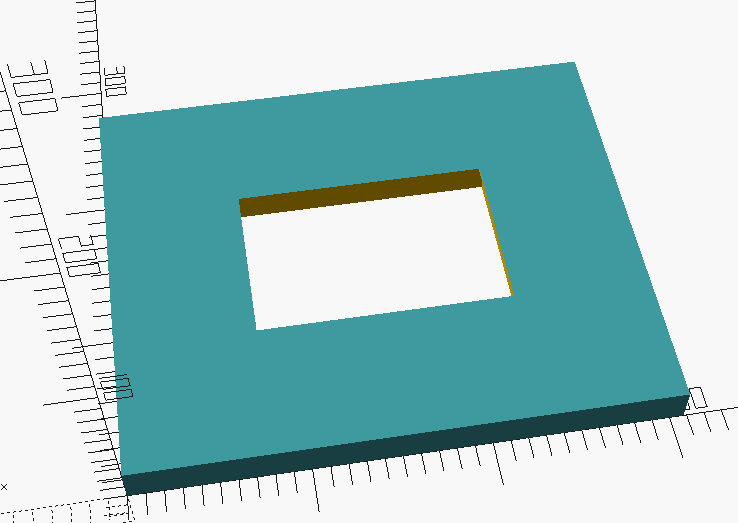
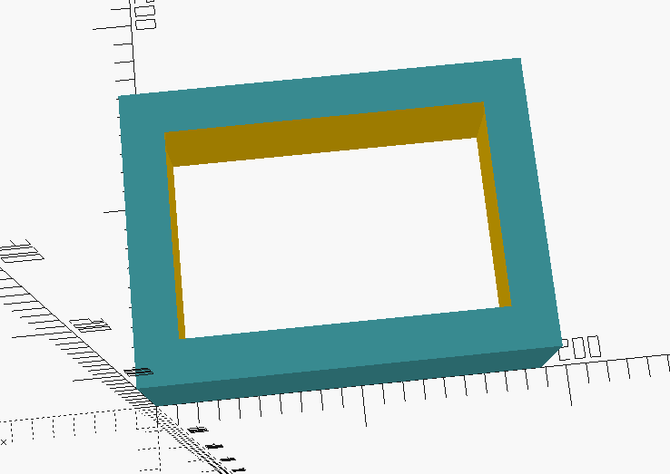
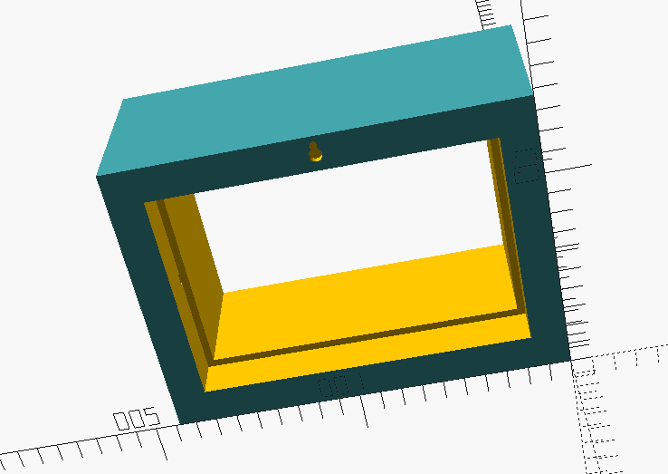

# OpenSCAD Photo Frame

A parametrized 3D photo Frame in OpenSCAD. Easily adjust the frame size,
thickness, depth, and photo inset.

## Parameters

- **nominal_dimensions** sets the photo size.
- **front_depth** sets the thickness of the frame in front of the photo. A high
  value here will create a shadow box effect.
- **back_depth** makes the photo frame thick or thin.

## Examples

**Wide Frame**

**Deep Frame**

**Shadow Box**

